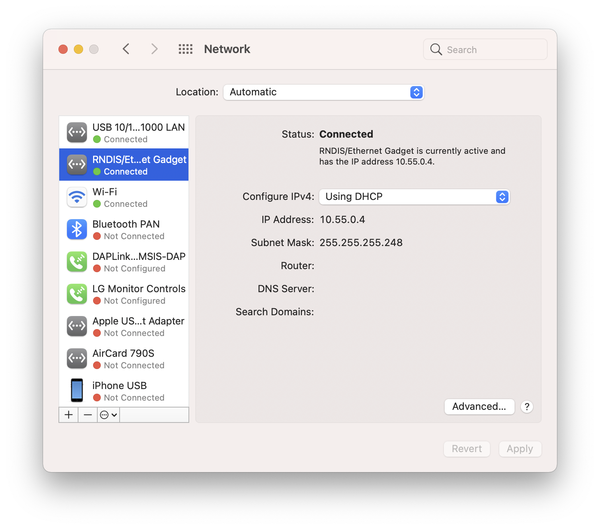

# Gadget

Use one cable for powering and communicating with your Raspberry PI device. This block sets up your device to work as an USB gadget, which you can access locally via the ethernet address 10.55.0.1.


## Supported devices

This should work with all Raspberry Pi devices that support OTG Mode. This means

- Raspberry Pi 4
- Raspberry Pi 3A/3A+ (not tested)
- Raspberry Pi Zero/Zero W

This will **NOT** work with a Raspberry 2B/2B+/3B/3B+. I have not tested with Raspberry Pi Zero 2.

## Usage 

The `gadget` block is meant to be used alongside other services, so you will need to create a service in your `docker-compose.yml` file.

```yaml
version: '2.1'

services:
  gadget:
  image: pipex/gadget:latest
    restart: on-failure
    # Needed to have access to the host network
    network_mode: host
    cap_add:
      # Needed to load kernel modules
      - SYS_MODULE
      # Needed to configure network
      - NET_ADMIN
    labels:
      # Needed for access to the host `/lib/modules` directory
      io.balena.features.kernel-modules: '1'
      # Needed for access to the host `/sys` directory
      io.balena.features.sysfs: '1'
```

The block also needs the device to be configured with the `dwc` [device tree overlay](https://www.balena.io/docs/reference/OS/advanced/#setting-device-tree-overlays-dtoverlay-and-parameters-dtparam) (`dtoverlay`). This can be done by setting the `BALENA_HOST_CONFIG_dtoverlay` variable under [device configuration](https://www.balena.io/docs/learn/manage/configuration/#device-configuration-management) if using the block with a [Balena device](https://www.balena.io) or by modifing [config.txt](https://www.raspberrypi.com/documentation/computers/config_txt.html) if using another OS.

The Raspberry Pi device needs to be connected to a host computer using an [USB On-The-Go cable](https://en.wikipedia.org/wiki/USB_On-The-Go), if using a Pi Zero (W), or a Thunderbolt 3 cable if using a Raspberry Pi 4.

When powered, the block will setup a `usb0` interface, and it will assign it the address `10.55.0.1`. The device should pop up as a RNDIS gadget under the host list of interfaces and it should automatically be assigned an IP address via DHCP.



## Environment Variables

| Name             | Description                                                                             | Default Value |
|------------------|-----------------------------------------------------------------------------------------|---------------|
| GADGET_ADDRESS   | IPv4 address for the gadget device. The address will also be used as a prefix for DHCP  | 10.55.0.1     |

